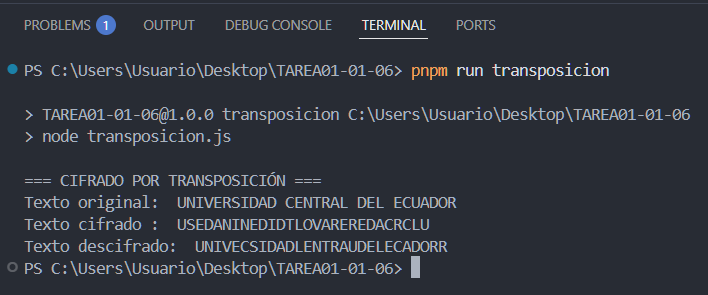

# 🔐 Proyecto de Cifrados Clásicos en Node.js

Implementación práctica de **Cifrado César** y **Cifrado por Transposición**, dos de los métodos de criptografía clásica más conocidos.  
El objetivo del proyecto es comprender cómo funcionan estos algoritmos básicos de cifrado y descifrado aplicados a un texto simple.

## 📘 Descripción del Proyecto

Este repositorio contiene dos scripts ejecutables en Node.js:

- `cesar.js` → Implementa el **Cifrado César**, desplazando las letras del alfabeto un número determinado de posiciones.
- `transposicion.js` → Implementa el **Cifrado por Transposición**, reorganizando las letras del texto original en función de una clave numérica.

El texto de ejemplo utilizado es:

```
UNIVERSIDAD CENTRAL DEL ECUADOR
```

## ⚙️ Requisitos Previos

Asegúrate de tener instalado:

- [Node.js](https://nodejs.org/) (versión 14 o superior)
- [npm](https://www.npmjs.com/) para ejecutar los scripts

## 🧩 Instalación y Ejecución

1. Clona el repositorio:
   ```bash
   git clone https://github.com/25-26-CSI/GRUPO6.git
   cd Tarea01-01-06
   ```

2. Instala dependencias (si las hubiera):
   ```bash
   npm install
   ```

3. Ejecuta el **Cifrado César**:
   ```bash
   npm run cesar
   ```

4. Ejecuta el **Cifrado por Transposición**:
   ```bash
   npm run transposicion
   ```


## 🧠 Ejemplo de salida

### Cifrado César


---

### Cifrado por Transposición


## 🧮 Estructura del Proyecto

```
/Tarea01-01-06
│
├── cesar.js               # Script del Cifrado César
├── transposicion.js       # Script del Cifrado por Transposición
├── package.json           # Configuración para npm run
└── README.md              # Documentación del proyecto
```

## 🧾 Licencia

Este proyecto se distribuye bajo la licencia **MIT**.  
Eres libre de usarlo, modificarlo y compartirlo con fines educativos o personales.

---

## 🤝 Colaboradores

Agradecimientos a todas las personas que aportaron al desarrollo del proyecto de criptografía 💚

| Nombre                               | Rol                                | Contacto                                  |
| ------------------------------------ | ---------------------------------- | ----------------------------------------- |
| **Condolo Byron**                    | Diseño de interfaz y usabilidad    | [GitHub](https://github.com/SumonPB)      |
| **Lascano Angelo**                   | Documentación técnica              | —                                         |
| **Loya Bryan**                       | Pruebas y control de calidad       | [GitHub](https://github.com/Bryan1093)    |
| **Rosero Ruth**                      | Análisis y validación de algoritmos| —                                         |
| **Tapia Freddy**                     | Integración y soporte de código    | [GitHub](https://github.com/XavierT1)     |
| **Trujillo Dennis**                  | Desarrollador principal            | [GitHub](https://github.com/Dennis290699) |

## 🚀 ¿Quieres colaborar?

🙌 ¡Tu ayuda es bienvenida!  
Haz un **fork**, crea una nueva rama con tus cambios y envía un **pull request** con tus mejoras.  
Toda contribución será revisada y reconocida.


**Desarrollado con 💻 y pasión por la criptografía clásica.**

